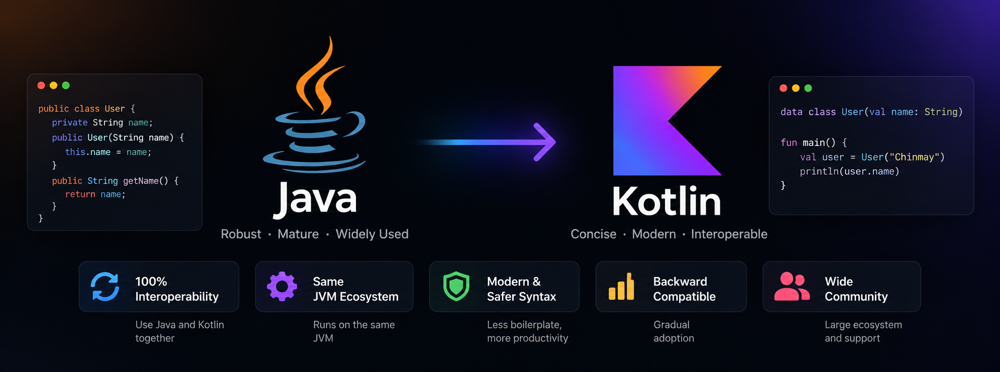
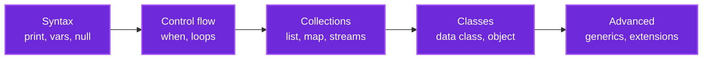

<div align="center">

# ☕ → 🟣 From Java To Kotlin

### Your interactive cheat sheet for the Java → Kotlin transition — every concept, side by side.

<p>
  <a href="https://github.com/chinmay-tayade/from-java-to-kotlin/blob/main/LICENSE"></a>
  <a href="https://github.com/chinmay-tayade/from-java-to-kotlin/stargazers"></a>
  <a href="https://kotlinlang.org"></a>
  <a href="https://www.java.com"></a>
</p>



</div>

---

## 🎯 About this cheat sheet

Moving from Java to Kotlin isn't about memorizing syntax — it's about **unlearning boilerplate**. Kotlin takes patterns you write in 30 lines of Java and expresses them in one or two, while making whole classes of bugs (null-pointer crashes) impossible by design.

> Every section below shows the **Java way → the Kotlin way**, with the "why" noted where it matters.

---

## 🧭 Cheat-sheet map



---

## 📚 Table of contents

- [Basics](#basics) — printing, variables, nullability
- [Strings](#strings) — concatenation, multiline, substring
- [Control flow](#control-flow) — conditions, `when`, loops
- [Collections](#collections) — lists, maps, iteration, sorting
- [Classes & objects](#classes--objects) — constructors, data classes, `object`
- [Advanced](#advanced) — generics, extensions, `lateinit`, enums

---

## 🔤 Basics

<details open>
<summary><b>Print to console</b></summary>

| Java | Kotlin |
|---|---|
| `System.out.print("Hi");`<br/>`System.out.println("Hi");` | `print("Hi")`<br/>`println("Hi")` |

</details>

<details open>
<summary><b>Constants and variables</b></summary>

| Java | Kotlin |
|---|---|
| `String name = "John";`<br/>`final String name = "John";` | `var name = "John"`<br/>`val name = "John"` |

> 💡 `val` = read-only (like `final`), `var` = mutable.

</details>

<details open>
<summary><b>Null-safety (the big one)</b></summary>

| Java | Kotlin |
|---|---|
| `String otherName = null;` | `var otherName: String? = null` |
| `if (text != null) { int len = text.length(); }` | `text?.let { val len = text.length }`<br/>or simply `val len = text?.length` |

> 🛡️ In Kotlin, a type is **non-null by default**. You must opt *in* to null with `?` — which is why NPEs are rare and explicit.

</details>

<details>
<summary><b>Checking not-null / not-empty</b></summary>

| Java | Kotlin |
|---|---|
| `if (!s.isEmpty()) { ... }`<br/>`if (s != null && !s.isEmpty()) { ... }` | `if (s.isNotEmpty()) { ... }`<br/>`if (!s.isNullOrEmpty()) { ... }` |

</details>

---

## 🧵 Strings

<details>
<summary><b>Concatenation (string templates)</b></summary>

| Java | Kotlin |
|---|---|
| `"My name is: " + first + " " + last;` | `"My name is: $first $last"` |

</details>

<details>
<summary><b>Multiline strings</b></summary>

| Java | Kotlin |
|---|---|
| `"First\n" + "Second\n" + "Third";` | `"""`<br/>`  First`<br/>`  Second`<br/>`  Third`<br/>`""".trimIndent()` |

</details>

<details>
<summary><b>Substring</b></summary>

| Java | Kotlin |
|---|---|
| `str.substring(0, 4)` | `str.substring(0..3)` |

> 💡 Kotlin uses **inclusive ranges**, Java uses half-open indices.

</details>

---

## 🔀 Control flow

<details>
<summary><b>Ternary operator</b></summary>

| Java | Kotlin |
|---|---|
| `x > 5 ? "x > 5" : "x <= 5"` | `if (x > 5) "x > 5" else "x <= 5"` |
| `message != null ? message : ""` | `message ?: ""` (Elvis operator) |

</details>

<details>
<summary><b>Bitwise operators</b></summary>

| Java | Kotlin |
|---|---|
| `a & b` · `a \| b` · `a ^ b` | `a and b` · `a or b` · `a xor b` |
| `a >> 2` · `a << 2` · `a >>> 2` | `a shr 2` · `a shl 2` · `a ushr 2` |

</details>

<details>
<summary><b>Type check & casting</b></summary>

| Java | Kotlin |
|---|---|
| `if (obj instanceof Car) { Car c = (Car) obj; }` | `if (obj is Car) { var c = obj as Car }` |
| — | `var c = obj as? Car` (safe cast, nulls instead of throwing) |

</details>

<details>
<summary><b>Smart cast (no explicit cast needed)</b></summary>

| Java | Kotlin |
|---|---|
| `if (obj instanceof Car) { Car c = (Car) obj; }` | `if (obj is Car) { var c = obj }` — cast is **implicit** ✨ |

</details>

<details>
<summary><b>Range check (multiple conditions)</b></summary>

| Java | Kotlin |
|---|---|
| `if (score >= 0 && score <= 300) { }` | `if (score in 0..300) { }` |

</details>

<details>
<summary><b>Switch → `when`</b></summary>

| Java | Kotlin |
|---|---|
| `switch (score) { case 10: case 9: grade = "Excellent"; break; ... }` | `when (score) { 9, 10 -> "Excellent"; in 6..8 -> "Good"; 4, 5 -> "OK"; else -> "Fail" }` |

> 💡 `when` is an **expression** — it returns a value, no `break` needed.

</details>

<details>
<summary><b>For-loops</b></summary>

| Java | Kotlin |
|---|---|
| `for (int i = 1; i <= 10; i++)` | `for (i in 1..10)` |
| `for (int i = 1; i < 10; i++)` | `for (i in 1 until 10)` |
| `for (int i = 10; i >= 0; i--)` | `for (i in 10 downTo 0)` |
| `for (int i = 1; i <= 10; i+=2)` | `for (i in 1..10 step 2)` |
| `for (String item : collection)` | `for (item in collection)` |
| `for (Map.Entry e : map.entrySet())` | `for ((key, value) in map)` |

</details>

---

## 🗃️ Collections

<details>
<summary><b>Creating lists & maps</b></summary>

| Java | Kotlin |
|---|---|
| `Arrays.asList(1, 2, 3, 4)` / `List.of(1, 2, 3, 4)` | `listOf(1, 2, 3, 4)` |
| `Map.of(1, "John", 2, "Aarav")` | `mapOf(1 to "John", 2 to "Aarav")` |

</details>

<details>
<summary><b>Iterating (`forEach` / `filter`)</b></summary>

| Java | Kotlin |
|---|---|
| `cars.stream().filter(c -> c.speed > 100).forEach(...)` | `cars.filter { it.speed > 100 }.forEach { ... }` |

</details>

<details>
<summary><b>Destructuring a split</b></summary>

| Java | Kotlin |
|---|---|
| `String[] s = "param=car".split("=");` | `val (param, value) = "param=car".split("=")` |

</details>

<details>
<summary><b>Sorting a list</b></summary>

| Java | Kotlin |
|---|---|
| `Collections.sort(list, new Comparator<Profile>() { ... })` | `list.sortedWith(compareBy { it.age })` |

</details>

---

## 🏗️ Classes & objects

<details>
<summary><b>Defining functions</b></summary>

| Java | Kotlin |
|---|---|
| `void doSomething() { }` | `fun doSomething() { }` |
| `int getScore() { return score; }` | `fun getScore(): Int = score` (single-expression) |

</details>

<details>
<summary><b>Default parameter values</b></summary>

| Java (needs overloading) | Kotlin |
|---|---|
| `double cost(int q, double p) { return p*q; }`<br/>`double cost(int q) { return 20.5*q; }` | `fun cost(q: Int, p: Double = 20.5) = q * p` |

</details>

<details>
<summary><b>Varargs</b></summary>

| Java | Kotlin |
|---|---|
| `void doSomething(int... numbers)` | `fun doSomething(vararg numbers: Int)` |

</details>

<details>
<summary><b>Data class vs. full POJO (the headline)</b></summary>

| Java (a whole `equals`/`hashCode`/`toString` POJO) | Kotlin |
|---|---|
| ~30 lines of getters, setters, `equals`, `hashCode`, `toString` | `data class Developer(var name: String, var age: Int)` |

> 🎯 This is the single biggest productivity win in Kotlin — one line replaces 30.

</details>

<details>
<summary><b>Copy / clone</b></summary>

| Java (implements `Cloneable` + `clone()`) | Kotlin |
|---|---|
| `Developer dev2 = (Developer) dev.clone();` | `val dev2 = dev.copy(age = 25)` |

</details>

<details>
<summary><b>Singleton (`object`)</b></summary>

| Java (private ctor + static) | Kotlin |
|---|---|
| `class Utils { private Utils() {} public static ... }` | `object Utils { fun getScore(v: Int) = 2 * v }` |

</details>

<details>
<summary><b>Companion object (static members)</b></summary>

| Java | Kotlin |
|---|---|
| `Utils.getScore(3)` (static) | `class Utils { companion object { fun getScore(v: Int) = 2*v } }` |

</details>

<details>
<summary><b>Anonymous class → object expression</b></summary>

| Java | Kotlin |
|---|---|
| `new AsyncTask<Void, Void, Profile>() { ... }` | `object : AsyncTask<Void, Void, Profile>() { ... }` |

</details>

<details>
<summary><b>Initialization block</b></summary>

| Java | Kotlin |
|---|---|
| `class User { { System.out.println("init"); } }` | `class User { init { println("init") } }` |

</details>

<details>
<summary><b>`lateinit` (uninitialized, set later)</b></summary>

| Java | Kotlin |
|---|---|
| `Person person;` (field) | `lateinit var person: Person` |

</details>

<details>
<summary><b>Enums</b></summary>

| Java | Kotlin |
|---|---|
| `enum Direction { NORTH(1); int d; Direction(int d){...} }` | `enum class Direction(val d: Int) { NORTH(1), SOUTH(2) }` |

</details>

---

## 🚀 Advanced

<details>
<summary><b>Generics</b></summary>

| Java | Kotlin |
|---|---|
| `interface SomeInterface<T> { void doSomething(T data); }` | `interface SomeInterface<T> { fun doSomething(data: T) }` |
| `SomeInterface<T extends Collection<?>>` | `SomeInterface<T : Collection<*>>` |

</details>

<details>
<summary><b>Extension functions (the killer feature)</b></summary>

| Java (static util class) | Kotlin |
|---|---|
| `Utils.triple(3)` | `fun Int.triple(): Int = this * 3` → `3.triple()` |

> 🎯 Add methods to types you don't own, without inheritance.

</details>

---

## 🧠 Keep going — official Kotlin references

| Topic | Link |
|---|---|
| Kotlin official docs | [kotlinlang.org/docs](https://kotlinlang.org/docs/home.html) |
| Coroutines guide | [kotlinlang.org/docs/coroutines-overview.html](https://kotlinlang.org/docs/coroutines-overview.html) |
| Flow guide | [kotlinlang.org/docs/flow.html](https://kotlinlang.org/docs/flow.html) |
| Kotlin coding conventions | [kotlinlang.org/docs/coding-conventions.html](https://kotlinlang.org/docs/coding-conventions.html) |

---

## 📜 License

```
Licensed under the Apache License, Version 2.0 (the "License");
you may not use this file except in compliance with the License.
You may obtain a copy of the License at

    http://www.apache.org/licenses/LICENSE-2.0

Unless required by applicable law or agreed to in writing, software
distributed under the License is distributed on an "AS IS" BASIS,
WITHOUT WARRANTIES OR CONDITIONS OF ANY KIND, either express or implied.
See the License for the specific language governing permissions and
limitations under the License.
```

---

## 🤝 Contributing

Spot a missing Java→Kotlin pair, or a better idiomatic Kotlin example? Open a pull request.

> 💚 If this cheat sheet saved you time, drop a ⭐.
